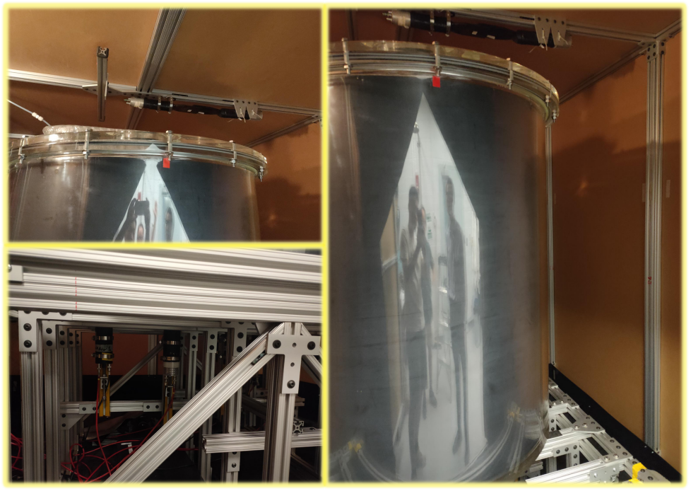
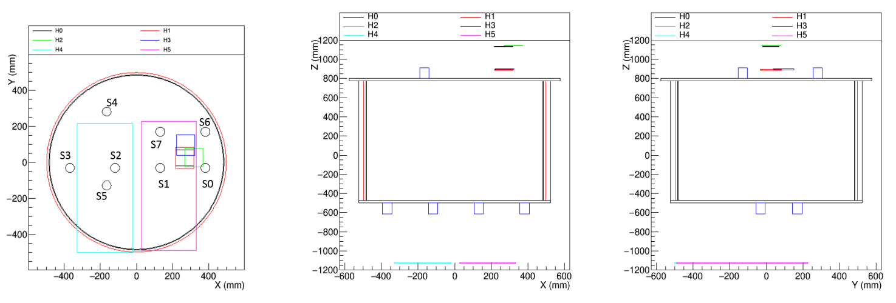
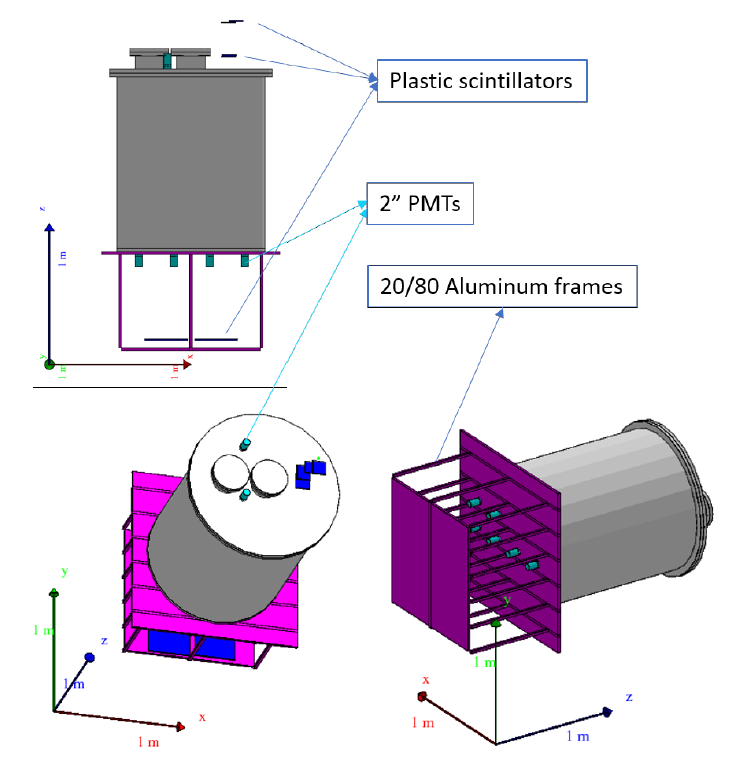
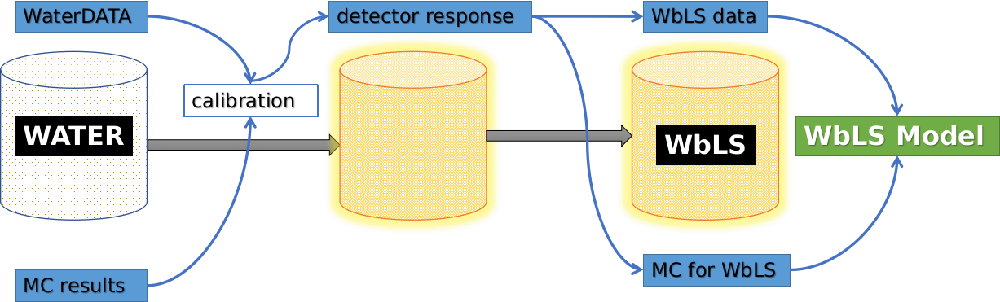

# Introduction about the BNL 1ton detector

The **BNL 1Ton Detector** was constructed to study the  performance of water-base liquidscintillator(WbLS) in larger scale.
 The motivation is trying to understand optical model of WbLS(the interaction,propagation of both cherencov and scintallation light); the ultimate aim is to build a model which can be ultilized to predict
the performance of WbLS in very large scale detector.

 
### Schedule of the data analysis work
- [x] water phase data for [dector calibration](analysis-water/analysis-water.md) `working on`
- [ ] WbLS data analysis
- [ ] WbLS results

-------------------

## WbLS and its advantages 
- Pure water detector:
>Cherenkov light emission when charged particle passes
through with above threshold energy (β ≥ c/n). Cherenkov light has directionality
so particle tracks can be reconstructed.
- Traditional liquid scintillator detector: 
>utilizes scintillation linght, with a yield(of N
photons per MeV energy), photons go isotropically.

-------------------

Water-based Liquid Scintillator (WbLS) is a stable scintillating emulsion with a large fraction(∼ 99%) of aqueous phase.The combination of water and LS is promising(or hypothesis) for keeping
both Cherenkov light’s directionality and scintillation light’s high yield. So with just
a little LS(and majority of water) light yield is still sufficient, and detection
threshold can be lowered to possiblly low energy interactions.

-------------------
R&D work has been done on small scales(1L ∼ 2.5L) of WbLS, by measuring their
photon absorption/reemission spectrum, distinguishing of Cherenkov light from
scintillating light and radiation hardness.
Main Goal:To understand the performance of WbLS in a large volume, to mimic the
situation of a real future experiment.
 
### the advantages:
- cheaper than conventional organic Liquid Scintillator (LS) for large detector;
- more isotopes can be dissolved in water;
- long optical attenuation length(tens of meters);
- both Cherenkov light and scintillation light(wider energy range);

### potential application fields:
- Neutrinoless double beta decay
- high energy neutrino beam measurements
- proton decay
- low energy neutrino physics

## Geometry of the BNL 1Ton detector
main components:
- 1ton WbLS inside a cylindrical tank
- 3 group of(6 plastic scintillators) hodoscopes as trigger system
- 8 2-inch PMTs as the photon detector
- a ∼410nm LED for PMT calibration
 

## detector commissioning

Water data taking from 01/02/2018 to 07/16/2018

WbLS data taking from 08/06/2018 to 10/10/2018 

### basic trigger information 
For each trigger event, the DAQ will record:
- waveform(2560 samples per frame) of 8PMTs
- time information of hodoscopes and PMTs
- trigger tag of each PMT and hodoscopes
- slow control information:liquid level, resistance of water, temperature, etc.

............................................................................... 

Hardware trigger type and logic:
1. **hodoscope_trig**:∼ 3Hz 
(H0 ||H2) && (H3 || H1)|| H4 || H5
2. **multiplicity_trig**: ∼ 10 − 40Hz 
$N_{fired−PMT}$ ≥ 6
3. **LED_trig**: 0.5Hz  
for the PMT gain calibration

##  work flow of analysis

1. Fill the vessel with water and record cosmic ray data
2. Build a simulation model to predict results
3. Compare data and simulation, determine the parameters of model
4. Replace water with WbLS; adapt the WbLS model in simulation
5. Get WbLS optical model and corresponding parameters
 
## calibration of detector response

For the 8PMTs with `hodo-trig` events, we can get the Npe distribution from 
experimental data, also from MC, then calculate the calibration factor
using the minimization of 
$$
\chi^2=\sum_{i}(\frac{\sum_{j}(Q_{i}\times N_{ij}^{data}-N_{ij}^{MC})}{\sigma_{ij}})^2
$$
where $Q_{i}$ is the calibration factor of $i$th PMT, $N_{ij}$is number of pe in the $j$th bin of 
$i$th PMT ,$\sigma_{ij}$ is the uncertainty of corresponding $N_{pe}$.

## contact
- email：<zhaor25@mail2.sysu.edu.cn>

---------
thanks for reading.
